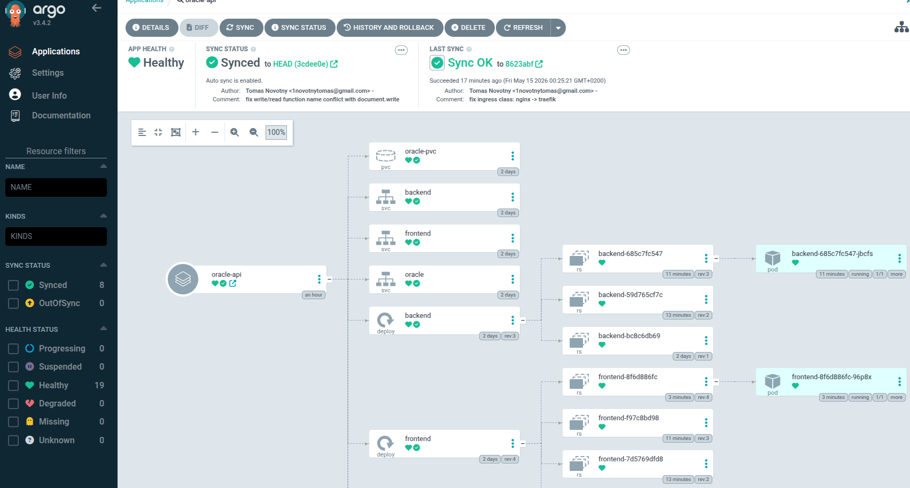
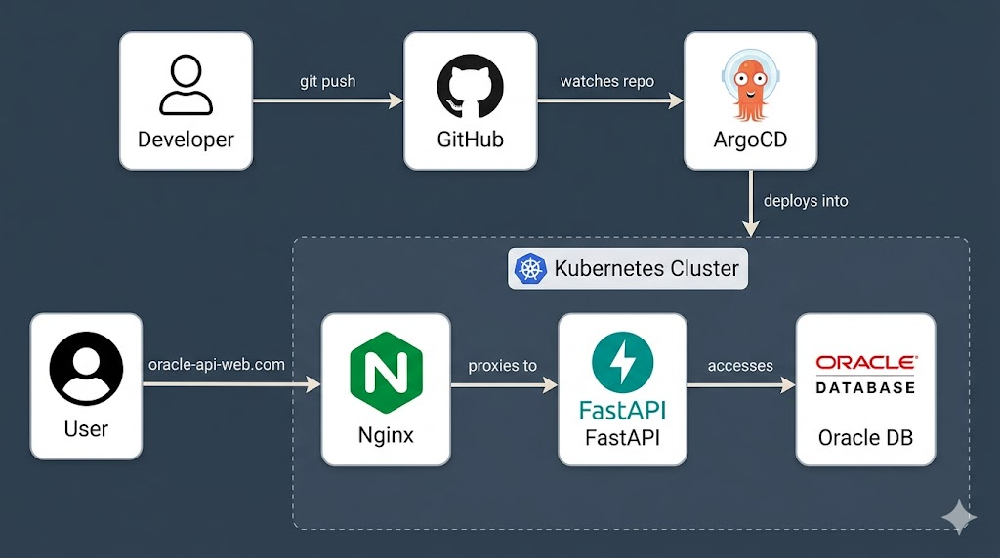

#  Kubernetes Oracle API | Infrastructure Demo





> A complete zero-to-production simulation: From local development to GitOps-driven deployment on a local Kubernetes cluster.

The application itself is intentionally simple, a frontend served by **Nginx** communicating with a **FastAPI** backend that reads/writes data to an **Oracle XE** database. 

**The primary focus is the infrastructure pipeline:** understanding how these modern technologies integrate and how code changes flow seamlessly from a Git commit all the way to a running container in Kubernetes.

---

## 🛠️ Tech Stack

| Component | Technology |
|:---|:---|
| **Frontend** |  HTML/JS |
| **Backend** |   |
| **Database** |  |
| **Containerization** |  |
| **Cluster** |  |
| **Orchestration** |  |
| **GitOps** |  |

---

## 📋 Prerequisites

Before you begin, ensure you have the following tools installed:
- [x] [Docker](https://docs.docker.com/get-docker/)
- [x] [k3d](https://k3d.io/)
- [x] [kubectl](https://kubernetes.io/docs/tasks/tools/)
- [x] [Helm](https://helm.sh/docs/intro/install/)
- [x] [ArgoCD CLI](https://argo-cd.readthedocs.io/en/stable/cli_installation/) *(optional)*

---

## 🍴 Forking this project

If you want to run this project with your own setup, change the following before deploying:

| What | Where | Change to |
|------|-------|-----------|
| Docker images | `helm/oracle-api/values.yaml` | your own DockerHub images |
| ArgoCD repo URL | `argocd-app.yaml` | your own GitHub repository URL |

**Build and push your own images:**
```bash
docker build -t <your-dockerhub-user>/frontend ./frontend
docker push <your-dockerhub-user>/frontend
docker build -t <your-dockerhub-user>/backend ./backend
docker push <your-dockerhub-user>/backend
```

Alternatively, you can use the original public images from Docker Hub (`uif18812/frontend`, `uif18812/backend`) without rebuilding — they will work out of the box.

---

##  Deployment Pathways

Choose the deployment method that fits your current testing needs, ranging from a quick local spin-up to a full GitOps pipeline.

### 📦 Option A — Local Development (Docker Compose)
*The fastest way to test the application logic locally.*

```bash
docker-compose up
```
* **Frontend:** http://localhost:8080
* **Backend:** http://localhost:8000

---

### ☸️ Option B — Kubernetes with Helm (Manual Deploy)
*Deploying the stack into a local Kubernetes cluster using Helm charts.*

**1. Create k3d cluster**
```bash
k3d cluster create mycluster
```

**2. Fix DNS (required for k3d)**
```bash
docker exec k3d-mycluster-server-0 sh -c 'echo "nameserver 8.8.8.8" >> /etc/resolv.conf'
kubectl get configmap coredns -n kube-system -o yaml | sed 's|forward . /etc/resolv.conf|forward . 8.8.8.8|' | kubectl apply -f -
kubectl delete pod -n kube-system -l k8s-app=kube-dns
```

**3. Deploy with Helm**
```bash
helm install oracle-api ./helm/oracle-api \
  --set oracle.env.ORACLE_PASSWORD=oracle \
  --set backend.env.DB_USER=system \
  --set backend.env.DB_PASS=oracle \
  --namespace production \
  --create-namespace
```

**4. Create Oracle table**
```bash
kubectl exec -it -n production <oracle-pod> -- sqlplus system/oracle@localhost:1521/xe
```

```sql
CREATE TABLE my_table (text_column VARCHAR2(255));
exit
```

**5. Add host entry**
```bash
echo "172.19.0.3 oracle-api-web.com" | sudo tee -a /etc/hosts
```
🌐 **Access the app:** Open http://oracle-api-web.com

---

### 🐙 Option C — Kubernetes with Helm + ArgoCD (GitOps)
*The ultimate declarative setup. ArgoCD monitors the repository and synchronizes the cluster state automatically.*

**1. Create k3d cluster**
```bash
k3d cluster create mycluster
```

**2. Fix DNS (required for k3d)**
```bash
docker exec k3d-mycluster-server-0 sh -c 'echo "nameserver 8.8.8.8" >> /etc/resolv.conf'
kubectl get configmap coredns -n kube-system -o yaml | sed 's|forward . /etc/resolv.conf|forward . 8.8.8.8|' | kubectl apply -f -
kubectl delete pod -n kube-system -l k8s-app=kube-dns
```

**3. Install ArgoCD**
```bash
kubectl create namespace argocd
kubectl apply -n argocd -f [https://raw.githubusercontent.com/argoproj/argo-cd/stable/manifests/install.yaml](https://raw.githubusercontent.com/argoproj/argo-cd/stable/manifests/install.yaml)
kubectl get pods -n argocd -w
```

**4. Access ArgoCD UI**
```bash
kubectl port-forward svc/argocd-server -n argocd 7080:443
kubectl get secret argocd-initial-admin-secret -n argocd -o jsonpath="{.data.password}" | base64 -d
```
🌐 **Access the UI:** Open https://localhost:7080 — username: `admin`, password: *(from the command above)*

**5. Create Secret manually** 
*(Security best practice: Passwords stay out of Git)*
```bash
kubectl create namespace production
kubectl create secret generic oracle-secret \
  --from-literal=ORACLE_PASSWORD=oracle \
  --from-literal=DB_USER=system \
  --from-literal=DB_PASS=oracle \
  --namespace production
```

**6. Deploy ArgoCD Application**
```bash
kubectl apply -f argocd-app.yaml
```
> 💡 *ArgoCD will now automatically deploy any changes pushed to this repository.*

**7. Create Oracle table**
```bash
kubectl exec -it -n production <oracle-pod> -- sqlplus system/oracle@localhost:1521/xe
```

```sql
CREATE TABLE my_table (text_column VARCHAR2(255));
exit
```

**8. Add host entry**
```bash
echo "172.19.0.3 oracle-api-web.com" | sudo tee -a /etc/hosts
```
🌐 **Access the app:** Open http://oracle-api-web.com

---

## 🔄 Updating the Application

Depending on what you modify, here is the flow to propagate updates:

**If you change application code (`index.html` or `main.py`):**
```bash
docker build -t <dockerhub-user>/frontend ./frontend
docker push <dockerhub-user>/frontend
docker build -t <dockerhub-user>/backend ./backend
docker push <dockerhub-user>/backend
k3d image import <dockerhub-user>/frontend:latest <dockerhub-user>/backend:latest -c mycluster
kubectl rollout restart deployment frontend backend -n production
```

**If you change infrastructure (Helm chart files):**
Simply commit and `git push`. ArgoCD handles the synchronization automatically. 
